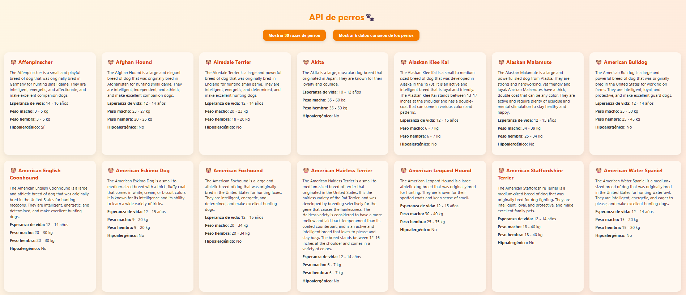
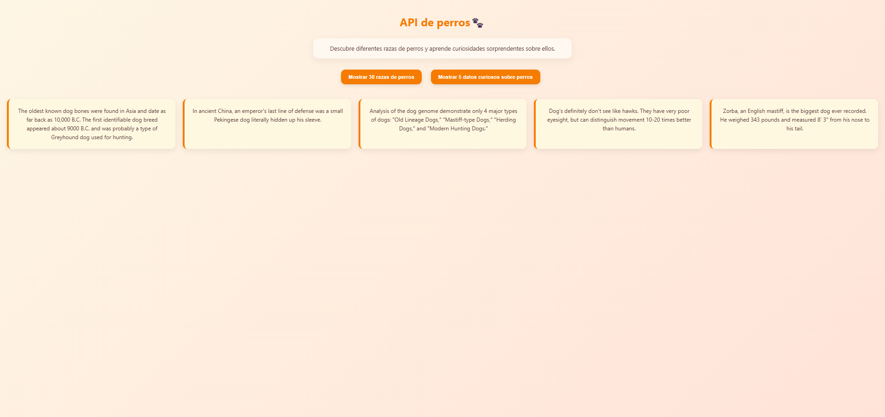

# 🐶 API de Perros

Aplicación web que consume la API pública https://dogapi.dog para mostrar:

- 30 razas de perros
- 5 datos curiosos
- Manejo de errores
- Diseño responsive

## 🚀 Tecnologías utilizadas
- HTML5
- CSS3
- JavaScript
- jQuery
- AJAX
- API REST

## 📷 Captura
Página de razas de perros

Página de datos curiosos sobre perros

## 🌐 Demo
Puedes ver la demo en vivo usando GitHub Pages:
[Demo en GitHub Pages](https://sandragonzalezdiaz1.github.io/api-perros/)
